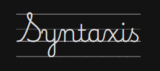

[](https://opensource.org/licenses/Apache-2.0)
[](https://rustup.rs/)

Deterministic, offline English structural analysis for Rust, Wasm, and data
pipelines.

Syntaxis is a **structural-analysis engine**, not a general proofreading tool.
Given bounded English text, it produces one versioned analysis containing
tokens, morphology, dependency arcs, grammar diagnostics, provenance, and a
stable digest. Given strict CoNLL-U, it validates and preserves the supplied
annotations without pretending that import is parsing.

The product is for software that needs inspectable structure and reproducible
bytes: same input, same declared rules, same result. The native feature set has
no runtime dependencies, no model weights, no network, no clock, and no RNG.
The optional Wasm feature provides the same contract to JavaScript.

```
cargo test                          # full test suite, no network needed
cargo run -- "The cat are sleeping."              # canonical JSON analysis
cargo run --example demo                          # live tokenization / import / retraction
```

## Browser API

The optional `wasm` feature exposes the same canonical analysis contract to
JavaScript through `wasm-bindgen`:

```sh
wasm-pack build --target web --features wasm
```

The generated module exports `analyze_json(text)`, `digest(text)`,
`analyze_conllu(text)`, and `import_conllu_json(input)`. Each returns a deterministic string or a
deterministic error. Inputs are limited to 128 KiB; filesystem-based CLI
options are not part of the browser API.

See [the capability matrix](docs/CAPABILITY_MATRIX.md) for the supported
construction boundary, evidence, and explicit non-goals.

See [usage examples](docs/USAGE_EXAMPLES.md) for Rust, CLI, Wasm, CoNLL-U, and
graph-level integration flows.

## What's in the box

| crate | contains |
| --- | --- |
| `syntaxis::parser_core` | data model, spans, provenance, fact graph, canonical JSON, SHA-256 |
| `syntaxis::english_rules` | rule-pack loader, segmentation, tokenization, analysis pipeline |
| `syntaxis::conllu` | strict UD import/export and the versioned Penn↔UD projection |
| `syntaxis` binary | command-line front end |

`resources/en/` holds the versioned, checksummed reference artifacts.
`fixtures/` holds hand-annotated gold data.

## What Syntaxis does

**One snapshot per document.** `analyze()` returns a single `Analysis`. POS,
dependency, and grammar rules attach to this object and consume these token
identities; none re-tokenize.

**Determinism as a tested property.** Serialization is canonical JSON with
declared member order, no floats, no timestamps. `Analysis::digest()` is a
SHA-256 over the compact form. Two runs over the same bytes produce identical
output, and a test asserts it.

**Provenance on every fact.** Each token, sentence, arc, and diagnostic carries
a `SupportSet`: rule id, rule-pack id, derivation kind, and every source it
consumed. Sources are sorted and deduplicated so discovery order cannot leak
into the output.

**Retraction that cascades.** `FactGraph` maintains a reverse support index.
Retracting a source removes exactly its transitive dependents, in sorted order,
with no caller-side cleanup. Cycles terminate; siblings survive. Live example:
retracting the analysis of `cat` in *The cat are sleeping.* removes the two arcs
resting on it and nothing else.

**Uncertainty as data.** `ArcStatus` and `Resolution` are modelled, and
`Analysis::certainty_for` propagates uncertainty from arcs to anything derived
from them. `validate()` reports an `OverconfidentDiagnostic` when a diagnostic
claims more certainty than its supports allow — a result that cannot be
explained is a defect regardless of whether it is correct.

**Rule packs are checksummed.** The manifest declares versions, licences,
provenance, and SHA-256 for every artifact; the loader verifies embedded content
against it and refuses to start on mismatch. Every rule declares its supported
constructions and its blind spots.

**Strict CoNLL-U.** Multi-word tokens and empty nodes are rejected, not
flattened. Every error carries a line number. A declared `# text` that disagrees
with its tokens is an error. The bundled fixture round-trips byte-for-byte.

Two tokenizer invariants are tested over every input: concatenated surfaces
reproduce the input with whitespace removed, and every span slices back to
exactly its surface.

## Current scope

The current release is a foundation engine with a deliberately bounded first
grammar slice:

- deterministic lexical analysis (segmentation and tokenization);
- bounded dependency attachment over a native UD relation set;
- provenance-backed agreement, determiner, verb-form, negation-placement, and
  resolved-coordination diagnostics;
- strict CoNLL-U import/export with a versioned Penn↔UD projection.

What is **not** in scope yet, and is deliberately tracked as future work rather
than claimed as a feature:

- broader POS and morphology coverage — unknown open-class words are explicitly
  reported rather than guessed;
- complete dependency parsing — the engine emits explicit unsupported arcs
  outside its declared construction set;
- complete English grammar or dependency parsing;
- natural-language coverage beyond the construction-focused 500-case
  evaluation gate;
- NFC/NFD normalization, which needs either a dependency or a large embedded
  table;
- browser filesystem access, an HTTP service, or a bundled end-user interface.

## CLI

The `syntaxis` binary accepts text and emits canonical JSON by default; use
`--digest`, `--validate`, `--conllu-in FILE`, `--conllu-out`, or
`--retract-token ID` for machine-readable lifecycle operations. Use
`--evaluation` to run the original 500-case structural gate; that gate is a
construction-focused baseline, not a claim about natural-language coverage.

## Governance

- [Governance](GOVERNANCE.md)
- [Code of conduct](CODE_OF_CONDUCT.md)
- [Contributing](CONTRIBUTING.md)
- [Security](SECURITY.md)
- [Release process](RELEASE_PROCESS.md)

## License

Apache-2.0 — see [LICENSE](LICENSE).

---

## Support

This project is a safe space. Trans rights are human rights.

If you or someone you love needs support:

- [The Trevor Project](https://www.thetrevorproject.org/) — 24/7 for LGBTQ+ young people. Call 1-866-488-7386 or text START to 678-678
- [Trans Lifeline](https://translifeline.org/) — peer support run by and for trans people. US: 877-565-8860
- [988 Suicide & Crisis Lifeline](https://988lifeline.org/) — call or text 988
